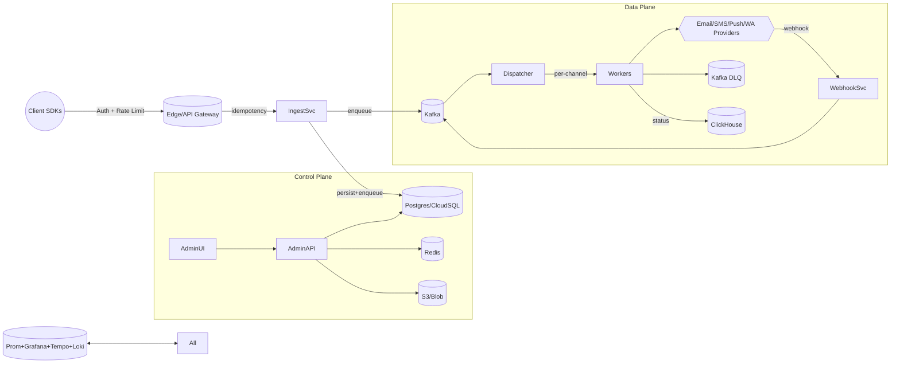

# High-Scale Notification Platform (HSNP)

## North Star Metrics

- **Delivery API**: p95 < 80 ms, 99.9% monthly availability
- **End-to-end dispatch**: p99 < 5s under 10k RPS
- **Data integrity**: < 1 in 10^9 duplicate deliveries per message-id
- **Scale targets**: Burst 1M messages/minute, sustained 200k messages/minute, multi-region active-active

## Macro Architecture

### Key Components

- **API Gateway**: Envoy/NGINX with JWT auth, tenant-aware rate limiting, request signing, and WAF rules.
- **Ingestion Service (Go)**: Payload validation, idempotency enforcement, writes to Postgres, publishes to Kafka.
- **Dispatcher (Go)**: Consumes `notifications` topic, fans out to per-channel queues, applies routing policy, throttling, priorities.
- **Channel Workers (Go)**: Email/SMS/Push/WhatsApp adapters, retries with exponential backoff, circuit breakers, DLQ support.
- **Webhook Service (Go)**: Normalizes provider callbacks, writes to Kafka, sinks into ClickHouse for analytics.
- **Template Service**: Manages templates, localization, A/B testing stored in object storage with Postgres index.
- **Rules Engine**: Segmenting, scheduling, smart routing.
- **Admin UI (Next.js)**: Tenant management, API keys, templates, segments, campaigns, dashboards.
- **Observability Stack**: OpenTelemetry, Prometheus, Grafana, Loki, Tempo with SLO burn alerts.

## Core Data Model

### Postgres

- `tenants(id, name, plan_tier, created_at)`
- `api_keys(id, tenant_id, key_hash, scopes, created_at, last_used_at)`
- `templates(id, tenant_id, channel, name, version, metadata_json, storage_url, created_at)`
- `messages(id, tenant_id, message_key, channel, to_json, template_id, payload_json, status, created_at)`
- `message_attempts(id, message_id, provider, status, error_code, next_retry_at, attempt_no, created_at)`
- `routing_policies(id, tenant_id, channel, priority_json, created_at)`
- `rate_limits(tenant_id, per_minute, burst)`
- `webhooks(id, tenant_id, url, secret, events[])`

### Kafka Topics

- `notifications`
- `dispatch.email`, `dispatch.sms`, `dispatch.push`, `dispatch.wa`
- `provider.events`
- `dlq.notifications`, `dlq.dispatch.*`

### ClickHouse

- `events`
- `deliveries_agg`

### Redis

- Idempotency keys: `idemp:{tenant}:{msgkey}` (TTL 24h)
- Rate limiter tokens: `rl:{tenant}`
- Hot template cache: `tpl:{id}:{version}`

## External APIs

### REST

- `POST /v1/notify` with headers `x-tenant-id`, `x-idempotency-key`.
- `GET /v1/messages/{message_id}`
- `GET /v1/stats`
- `POST /v1/webhooks/test`

### Webhooks

- Events: `queued`, `sent`, `delivered`, `opened`, `clicked`, `bounced`, `failed`.
- Signature: `X-HSNP-Signature: sha256=...` over raw body plus tenant secret.

## Messaging Semantics

- At-least-once delivery across Kafka and workers.
- Idempotency enforced at ingress and worker.
- Deduplication markers stored in Redis with TTL.
- Exponential backoff retries, DLQ after max attempts.
- Per-recipient ordering via partition hash of `(tenant_id, to)`.

## Routing & Provider Abstraction

- Provider interface: `Send(ctx, Message) (ProviderResp, error)`.
- Policies consider cost, SLA, error rates, throughput caps, geography.
- Failover on retryable errors; permanent failures marked accordingly.

## Observability & Ops

- Distributed tracing across API → Kafka → Workers → Providers → Webhook.
- Metrics: per-tenant QPS, queue lag, attempts, success/bounce rates, cost, latency percentiles.
- Logs: structured JSON, PII-scrubbed.
- Alerts: SLO burn rate, queue lag, provider error spikes, DLQ growth.

## Security & Compliance

- TLS everywhere, mTLS between services, least-privileged IAM.
- Secrets managed via KMS/Vault.
- PII minimization, encryption at rest, GDPR deletion by `message_id`.
- Audit logs on template edits and key usage.

## Deployment & Infrastructure

- Kubernetes with Helm charts, HPAs, PodDisruptionBudgets.
- Kafka with partitioning and retention policies.
- Postgres with replicas, pgBouncer, monthly partitions.
- ClickHouse with replicated storage and materialized views.
- CDN/WAF in front of API; Terraform + GitOps for IaC.

## Load Testing Plan

- k6 spike: 0 → 20k RPS in 2 min (5% duplicates).
- k6 soak: 5k RPS for 2 hours.
- Chaos: 50% provider failure for 10 minutes.
- Success: SLO adherence, bounded queues, cost metrics captured.

## Cost Model

- Kafka ≈ $0.02 per million messages.
- ClickHouse ≈ $1–3 per billion events per month.
- Outbound provider spend surfaced per tenant with target infra cost < 5% of provider spend at 100k msgs/day.

## Milestones

### Phase I — MVP

- Ingestion service + API.
- Kafka topics + dispatcher.
- Email worker with SES + SendGrid and failover.
- Webhook normalizer for email events.
- Admin UI for tenants, keys, templates.
- Baseline observability.

### Phase II — Multi-Channel & Analytics

- SMS, Push, WhatsApp channels.
- ClickHouse dashboards.
- Quiet hours, per-tenant rate limits, scheduled sends.
- Cost-aware routing, DLQ replay UI.

### Phase III — Scale & Multi-Region

- Multi-region active-active clusters.
- Global idempotency improvements, DR runbooks.
- Advanced segmentation, A/B testing, user journeys.

## Stretch Goals & Portfolio

- Journey builder, content experiments, real-time cost optimizer, per-tenant QoS.
- Public deliverables: mono-repo, live demo, dashboards, blog post "How we hit 1M msgs/min on a student budget."

## Next Steps

1. Scaffold Go services and Next.js admin.
2. Provision Kafka, Postgres, Redis, ClickHouse via Terraform.
3. Build MVP ingestion → email worker → webhook → dashboard loop.
4. Add automated tests and CI/CD.
5. Publish OpenAPI + SDKs and launch documentation.
